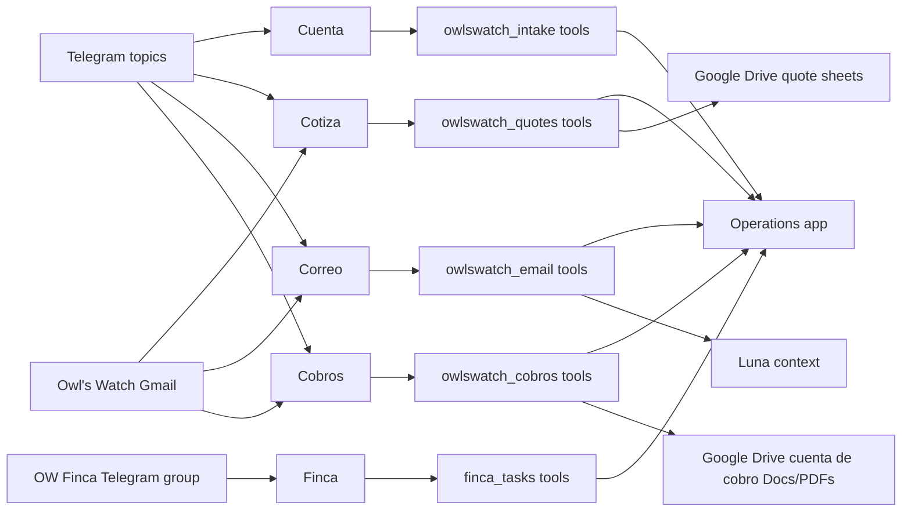

# Agent Architecture

Owl's Watch agents run on the Mac mini under the `owlswatch` OpenClaw profile.

## Source Of Truth

Operations is the system of record for expenses and quotes.

Agents create drafts only:

- Cuenta creates expense drafts.
- Cotiza creates quote drafts and revised quote drafts.
- Correo creates Email Desk draft tasks and optional Gmail drafts. Correo never sends email.
- Cobros creates cuenta de cobro Doc/PDF packets, Gmail draft replies with attached PDFs, and Email Desk review tasks. Cobros never sends email.

Google Drive stores editable quote sheets in `AI/Quotes`, but Operations remains canonical for IDs, status, totals, assumptions, and review.

Google Drive stores editable cuenta de cobro documents and exported PDFs in `AI/Cuentas de Cobro`. Operations Email Desk stores the review/audit task for v1.

## Repo Versus Runtime

This repo stores source and templates. The live runtime lives under:

- `~/.openclaw-owlswatch/`
- `~/.openclaw/workspace-owlswatch/`
- `~/.openclaw/workspace-owlswatch-cotiza/`
- `~/.openclaw/workspace-owlswatch-correo/`
- `~/.openclaw/workspace-owlswatch-cobros/`
- `~/.openclaw-finca/`
- `~/.openclaw/workspace-finca-ops/`

Do not commit runtime sessions, memory logs, spools, service-account JSON, auth state, or real `openclaw.json`.
